# Diagramas de flujo — UCU Talent

Diagramas para presentar el funcionamiento de la plataforma. Están escritos en lenguaje de
producto, sin endpoints ni detalles técnicos: la equivalencia con la API está al final de cada
sección, para consulta interna.

---

## 1. El camino del alumno

Desde que se registra hasta que sabe si quedó seleccionado.

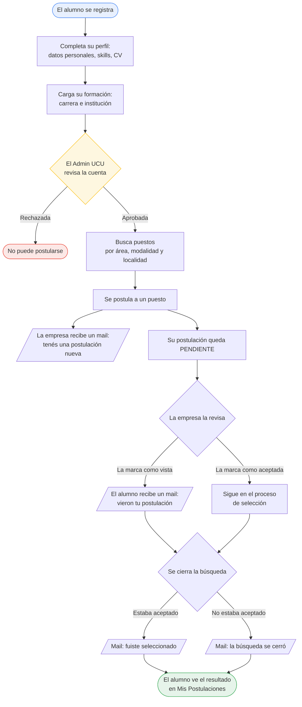

Equivalencia con la API (interno)

| Paso | Endpoint |
|---|---|
| Se registra | `POST /user` (nace `PENDIENTE`) |
| Completa perfil | `POST /student-profile` · `PATCH /student-profile/cv` |
| Carga formación | `POST /education` |
| El Admin lo aprueba | `PATCH /user/{id}` → `APROBADO` |
| Busca puestos | `GET /vacancy/student/search` |
| Se postula | `POST /vacancy-application` (nace `PENDIENTE`) |
| Ve sus postulaciones | `GET /vacancy-application/me/detailed` |

---

## 2. El camino de la empresa

En espejo con el anterior: desde que se registra hasta que cierra la búsqueda.

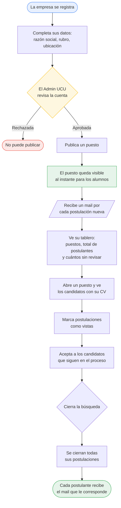

**El puesto se publica y se ve al instante** — la revisión del Admin viene después. Es una decisión
de diseño de la plataforma, no un descuido: se llama *moderación post-publicación*.

Equivalencia con la API (interno)

| Paso | Endpoint |
|---|---|
| Se registra | `POST /user` (nace `PENDIENTE`) |
| Completa datos | `POST /company` |
| El Admin la aprueba | `PATCH /user/{id}` → `APROBADO` |
| Publica un puesto | `POST /vacancy` (nace `PUBLICADO`) |
| Su tablero | `GET /vacancy/company/{companyId}/management` |
| Candidatos de un puesto | `GET /vacancy-application/vacancy/{vacancyId}/detailed` |
| Marca como vista | `PUT /vacancy-application/{id}` → `VISTO` |
| Acepta un candidato | `PATCH /vacancy-application/{id}/accept` |
| Cierra la búsqueda | `PATCH /vacancy/status/{id}` → `FINALIZADO` |

---

## 3. Ciclo de vida de un puesto

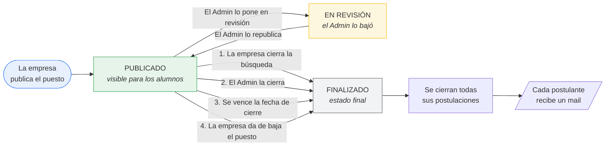

Equivalencia con la API (interno)

| Transición | Disparador |
|---|---|
| Nace `PUBLICADO` | `POST /vacancy` (`Vacancy.assignId()` lo setea si viene null) |
| `PUBLICADO` → `PENDIENTE` / vuelta | `PUT /vacancy/status/{id}` (solo ADMIN) |
| 1. Cierre de la empresa | `PATCH /vacancy/status/{id}` → `FINALIZADO` |
| 2. Cierre del Admin | `PUT /vacancy/status/{id}` → `FINALIZADO` |
| 3. Vencimiento | `VacancyServiceImpl.finalizeExpiredVacancies()`, cron diario 00:00 |
| 4. Baja lógica | `DELETE /vacancy/{id}` (`deleted = true`, no borra la fila) |
| Efecto común | `finalizeByVacancyId(...)` + `VacancyFinalizationNotifier` |

---

## 4. Ciclo de vida de una postulación

Tres estados que **solo avanzan**. Una postulación nunca vuelve a un estado anterior.

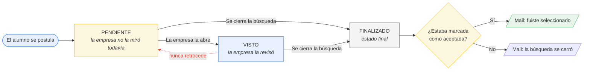

La marca de **aceptada** corre por un carril aparte: no cambia el estado, se puede poner en
cualquier momento antes del cierre, y es lo único que decide cuál de los dos correos recibe el
alumno.

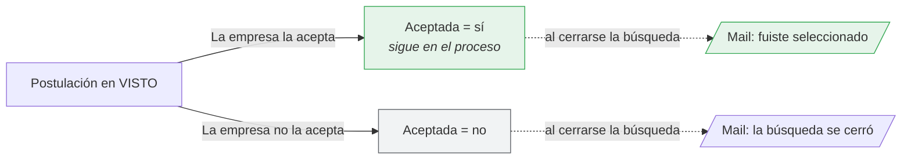

Y el cierre no lo hace la empresa postulación por postulación: cuando el puesto se cierra —por
cualquiera de sus cuatro caminos— **todas sus postulaciones pasan a `FINALIZADO` de una vez**.

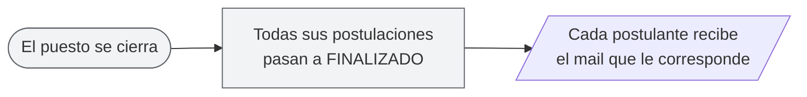

Equivalencia con la API (interno)

| Transición | Disparador |
|---|---|
| Nace `PENDIENTE` | `POST /vacancy-application` |
| `PENDIENTE` → `VISTO` | `PUT /vacancy-application/{id}` (empresa dueña de la vacante) |
| Marca de aceptada | `PATCH /vacancy-application/{id}/accept` (flag `accepted`, no es un estado) |
| Cierre en cascada | `finalizeByVacancyId(...)`, disparado por los 4 caminos del diagrama 3 |
| Retroceso bloqueado | `InvalidStatusTransitionException` → `409`, comparando `status.ordinal()` |
| El alumno la retira | `DELETE /vacancy-application/{id}` (solo el postulante) |

---

## 5. Moderación post-publicación

Cómo se modera el contenido, comparado con lo que hace la mayoría de los portales.

**Moderación previa — lo que hace la mayoría de los portales**

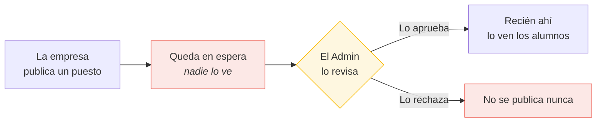

**Moderación post-publicación — UCU Talent**

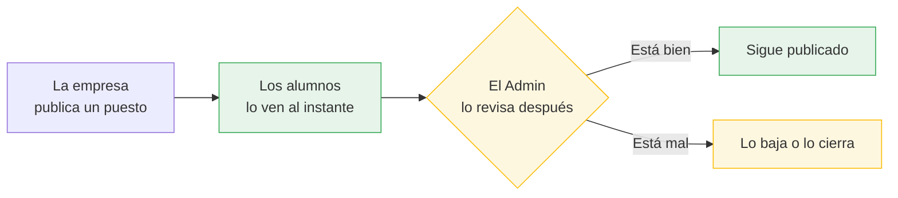

Equivalencia con la API (interno)

| Paso | Detalle |
|---|---|
| Nace publicado | `Vacancy` se persiste con `status = PUBLICADO` si no viene otro |
| El Admin lo baja | `PUT /vacancy/status/{id}` → `PENDIENTE` ("El Puesto está en revisión") |
| El Admin lo cierra | `PUT /vacancy/status/{id}` → `FINALIZADO` + comentario del Admin |
| Mientras está en revisión | la empresa no puede cambiarle el estado (`403`) |

---

## 6. Alcance de cada rol

Cada rol opera únicamente sobre lo suyo. La plataforma verifica en cada pedido quién lo está
haciendo.

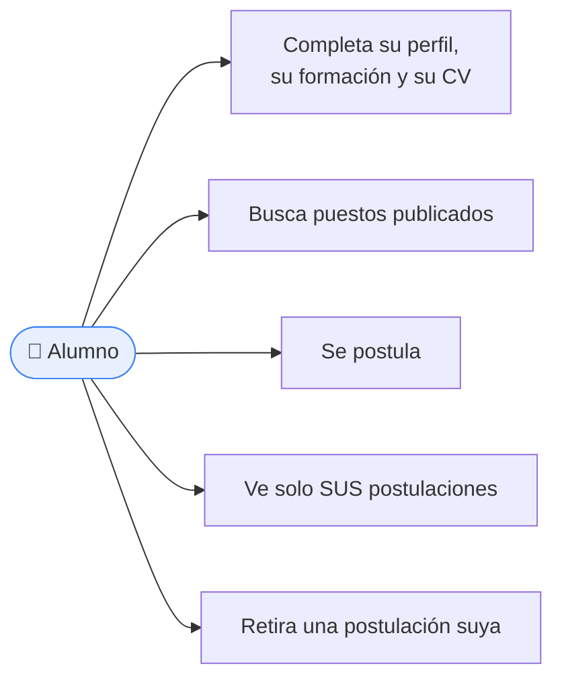

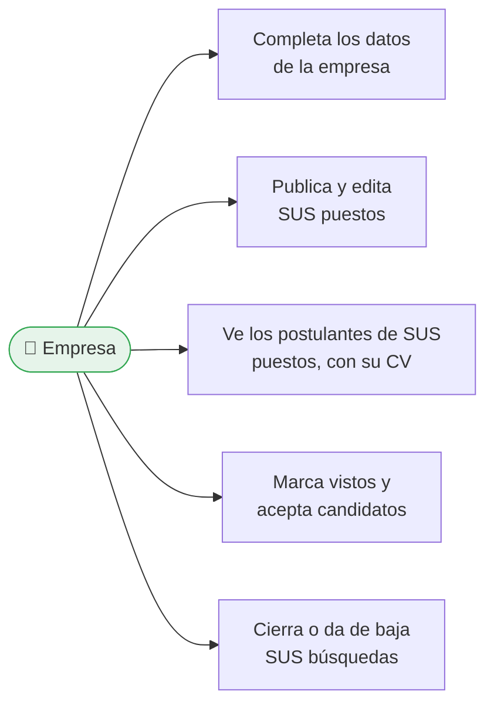

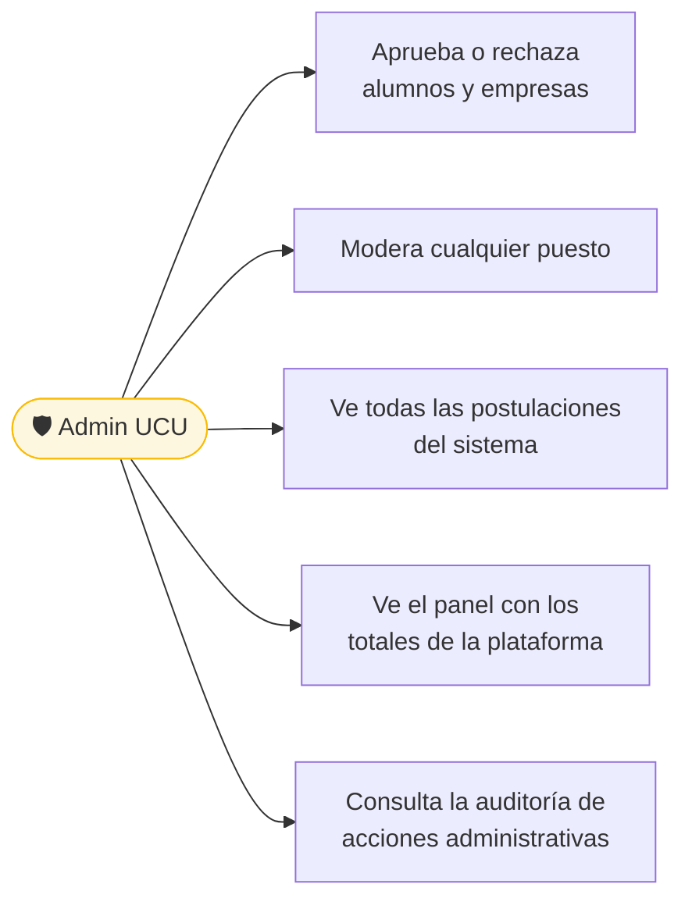

Equivalencia con la API (interno)

| Mecanismo | Detalle |
|---|---|
| Identidad | JWT en cookie `HttpOnly`; el id sale del token, nunca del body |
| Por rol | `hasRole("ALUMNO" \| "EMPRESA" \| "ADMIN")` en `SecurityConfig` |
| Por dueño | `AuthorizationGuard.requireOwnership(...)` / `requireOwnershipOrRoles(..., "ADMIN")` |
| Ejemplo de dueño | `GET /vacancy-application/vacancy/{vacancyId}/detailed` compara el `companyId` de la vacante contra el del token |
| Ejemplo sin id | `GET /vacancy-application/me/detailed` no recibe id: sale del token, así no hay forma de pedir el de otro |

